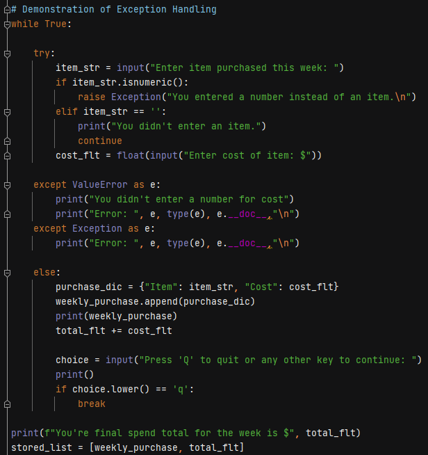
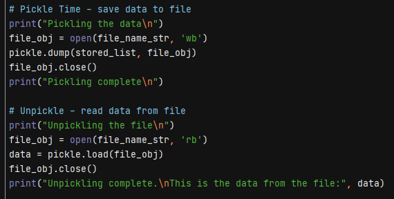
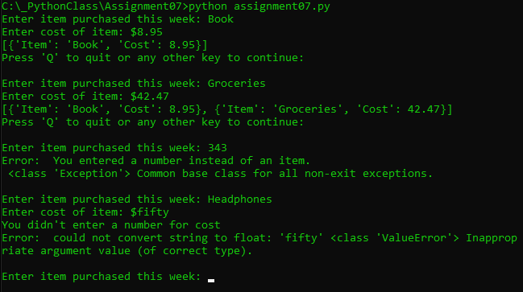
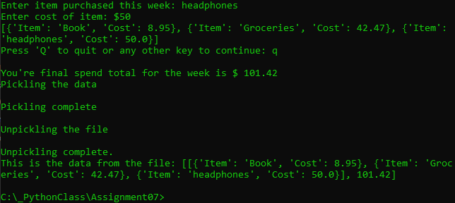
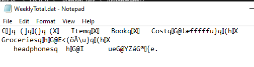

Alex Frain  
February 28, 2021  
IT FDN 110 B – Foundations of Programming, Python  
Assignment07  
https://github.com/alexfrain/IntroToProg-Python-Mod07

# Exception Handling and Pickling

## Introduction
This week’s assignment focused on two key concepts, exception handling and working with binary data files using Python’s pickle module.  These topics were introduced during class this week but the assignment had us doing our own Internet research to get a better understanding.  With the research in hand we were given a blank slate for the script and asked to demonstrate both concepts using examples of our choice.  The script I created is a weekly budget entry script where the user enters their purchases for the week (this is basically a modified version of the home inventory script from earlier in the quarter).  The user loops through the script entering an items purchased with their associated cost, each data pair is dictionary, and each dictionary item is added to a list.  Exception handling is added to account for the possibility of incorrect data being input by the user.  Once the user is done adding items the list is then added to a new list along with a float variable holding the total amount spent that week.  This new list is written to a binary file and then it’s read back into the script all through the use of the pickle module.

## Research
I’ve been using the [Real Python](https://realpython.com/) site as a reference throughout this class as they cover a breadth of topics for all levels of developers and frequently include tutorials to go along with them.  They were the first site I used when further researching both [exception handling](https://realpython.com/python-exceptions/#the-try-and-except-block-handling-exceptions) and [pickling](https://realpython.com/python-pickle-module/).  In both cases they provided an easy to understand definition of each before going into thorough detail within the subtopics but presenting it in a user friendly manner compared to more technical documentation.  It also helps that they provide plenty of examples to go along with the various aspects.

[TechBeamers](https://www.techbeamers.com/) was another site I found helpful when it came to researching [exception handling](https://www.techbeamers.com/python-exception-handling/) and [pickling](https://www.techbeamers.com/python-tutorial-using-pickle-for-serializing-python-objects/).  Both topics appeared to be specifically written with the beginner in mind so neither was overly technical in their explanations and they provided easy to follow examples for each subtopic.  The pickling topic specifically just covered the very basics so while it was less thorough than realpython.com it was even easier to follow and quickly got to the points of what a beginner should know.

## Creating the Script
### Exception Handling
My weekly budget script has its roots in the home inventory script created earlier in the quarter.  It starts by asking the user to enter an item purchased this week along with its cost.  A point where a user has to enter information is a point that can eventually lead to an exception depending on the operations being performed with the data.  “[An exception] occurs whenever syntactically correct Python code results in an error.”  (https://realpython.com/python-exceptions/#the-try-and-except-block-handling-exceptions, 2021)  Python has many built-in exceptions, too many to list here, that can be found in the python.org documentation, https://docs.python.org/3/library/exceptions.html.  One example which I specifically handle in my script and is a popular one used in numerous examples is the ValueError.  This type occurs when a function receives invalid values (e.g. trying to convert a nonnumeric string to a float using the float() function).

Python will stop running a program if an exception occurs unless it is explicitly handled in the code, in which case, a user friendly message can be displayed while the program itself continues to run.  The primary method of exception handling is done via the try-except statement.  You place a section of code that could possibly raise an exception in the try portion of the statement and then you place the code to handle any exceptions in the except portion.  In my script I place the input statements in the try block and the ValueError exception in an except block which will handle the issue of the user inputting non numeric characters when asked to enter the cost of the item (Figure 1).  Python will also provide an argument with their specific exceptions that give a Pythonic description of the error.  You can get this additional information in the except portion of the try-except statement if you assign it to a variable after the exception.  This is also demonstrated in Figure 1.

  
**Figure 1: Exception Handling**

Lastly, Python also offers the ability to raise an exception if a specific condition is not met which can also be seen in Figure 1.  I demonstrated raising an exception if the user only enters numbers for the name of the item.  It generates a nonspecific exception handled in the second except statement that uses the base Exception type.  In my research I found that this method of using the base Exception type is generally frowned upon.  It acts as a catch all for all errors so you could potentially catch an error that you weren’t expecting which could lead to problems later in the program.  The remainder of this section of the script adds the item and cost to a dictionary which then gets added to a list and a running total of the weekly spending is calculated.  Once the user is done entering items the list of dictionary items and the total weekly spending cost are both added to another list.

### Pickling
In previous assignments we worked with reading and writing data to a text file which is fine for very basic data.  When it comes to working with more complex data Python offers the ability serialize it which means converting it to bytes streams (that’s technical computer jargon) and saving it to a file.  That file could be sent to someone who could convert the byte stream in the file back to data (de-serializing) that Python can work with.  Another name for this is pickling (and unpickling).

In order to use pickling in the script I had to import Python’s pickle module.  The code to pickle and unpickle data to and from a file is almost the same as reading and writing to a text file.  Create a file object using the open() method and pass in the file name for the data file and the binary mode to open the file in, “wb” (write binary mode) in this case.  I then use the pickle module’s dump() method to write the final list generated in the script to a file by passing in the list and the file object.  Finally, the file object is closed.  The script then unpickles the file by, again, creating a file object using the same open() method but passing in “rb” (read binary mode) this time.  I use the pickle module’s load() method to unpickle the data in the file and assign it to a variable and then print it out (Figure 2).

  
**Figure 2: Pickling**

## Running the Script
I ran the script in both PyCharm and Windows command line confirming it worked successfully in both.  I entered a couple of items and their cost to confirm the expected input got added to dictionaries and, in turn, the dictionaries were added to a list.  I then tested the exception handling by first entering just numbers for the item name and received the custom error message along with Pythonic details for the general Exception class (Figure 3).  I then followed that up by entering an item name and then nonnumeric characters for the cost.  This raised the ValueError type exception and included the custom message which is also seen in Figure 3.

  
**Figure 3: Exception Handling**

I quit entering items to the list and confirmed the final list that included the list of dictionaries and the weekly total was pickled to the WeeklyTotal.dat file.  The file was then unpickled back into memory by the script and the data in the list is displayed (Figure 4). 

  
**Figure 4: Pickling/Unpickling**

Figure 5 shows the WeeklyTotal.dat file created by the script open in Notepad.

  
**Figure 5: WeeklyTotal.dat file created by script**

## Summary
In this assignment our initial task was to further research the topics of exception handling and pickling.  I was able to find a number of useful sites that covered both areas but as a Python beginner I especially liked https://realpython.com/ and https://www.techbeamers.com/ for their presentation.  I then created a script that performed basic demonstrations of both exception handling and pickling.  Exception handling is important to include in scripts in order to handle errors that may occur while the program is running which would normally cause it to stop.  They also allow you to customize a more user friendly message to the user that a problem was encountered compared the message Python would present by default.  The script also demonstrated pickling which is a means to convert data (usually more complex data) to a byte stream that could then be reconstructed (unpickled) when needed.  Pickling and unpickling data to and from a file is accomplished almost the same was as reading and writing data from a text file but the script needs to first import the pickle module which contains the required methods to accomplish this.

